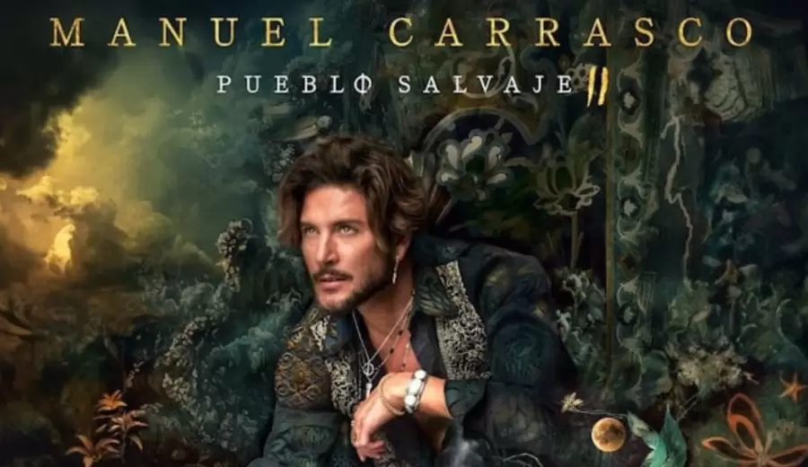
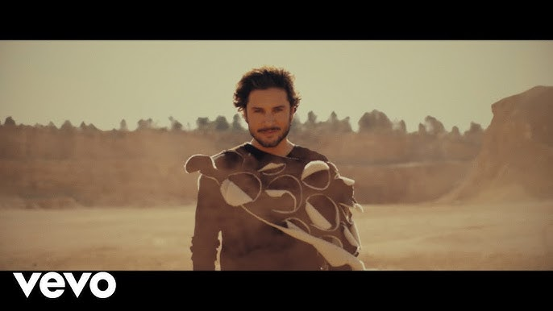

1

**<h1 style="text-align:center;">Manuel Carrasco en concierto</h1>**

| Gira | Año |Álbum Asociado |
|:-:|:-:|:-:|
| Bailar el Viento Tour | 2016–2017 | Bailar el Viento |
| La Cruz del Mapa Tour | 2019–2020 | La Cruz del Mapa|
| Corazón y Flecha Tour| 2023–2024| Corazón y Flecha|
| Hay Que Vivir el Momento Tour| 2025 (en curso) | Próximo álbum (por anunciar)|

### Esto es un encabezado <h3> de tercer nivel con Manuel Carrasco

Manuel Carrasco es un cantante y compositor español nacido en Isla Cristina, Huelva. Se dio a conocer tras participar en Operación Triunfo y desde entonces ha consolidado una exitosa carrera musical, destacando por su estilo emotivo y su conexión con el público. 

A lo largo de su trayectoria, ha lanzado varios álbumes exitosos como *Manuel Carrasco* (2003), *Tercera Parada* (2006), *Habla* (2009), *Confieso que he sentido* (2012), *Bailar el viento* (2015) y *La Cruz del Mapa* (2018). Sus canciones suelen combinar ritmos pop con influencias flamencas, y sus letras reflejan vivencias personales y emociones profundas.

Además, Manuel Carrasco ha sido galardonado con varios premios, incluyendo discos de platino y premios de la música española. Sus giras llenan estadios y auditorios, consolidándolo como uno de los artistas más queridos y respetados en el panorama musical en español.

Para más información, puedes visitar su página oficial o seguirlo en sus redes sociales.

Manuel Carrasco nació el 15 de enero de 1981 en Isla Cristina, Huelva. Desde muy joven mostró un gran interés por la música y la composición, lo que le llevó a presentarse en la segunda edición del programa *Operación Triunfo* en 2002, donde alcanzó gran popularidad.

Tras el programa, lanzó su primer álbum en 2003, que inició una carrera musical sólida y constante. A lo largo de los años ha publicado discos como *Tercera Parada* (2006), *Habla* (2009), *Confieso que he sentido* (2012), *Bailar el viento* (2015) y *La Cruz del Mapa* (2018), que han sido muy bien recibidos tanto por crítica como por público.

Su estilo mezcla el pop con elementos de la música andaluza, y sus letras suelen reflejar vivencias personales, emociones profundas y mensajes de esperanza. Además, Manuel es conocido por su humildad y cercanía con sus seguidores.

Fuera de la música, ha participado en campañas solidarias y ha mostrado compromiso con causas sociales, demostrando ser un artista comprometido tanto dentro como fuera del escenario.

Actualmente sigue activo en la música, realizando giras exitosas y preparando nuevos proyectos que mantienen viva su conexión con el público.

